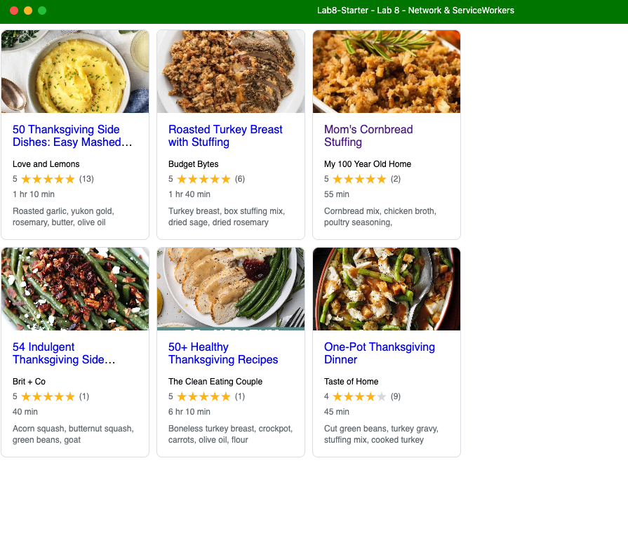

# Lab8-Starter

# CAMERON BLACK

Service Workers cache website contents, enabling offline access. Graceful Degradation ensures maximum functionality when online and a usable, cached version when offline. In the sw.js file, resources from RECIPE_URLS are fetched and cached, allowing users to navigate and access the site even without connectivity.

URL for page: https://camman00.github.io/Lab8-Starter/